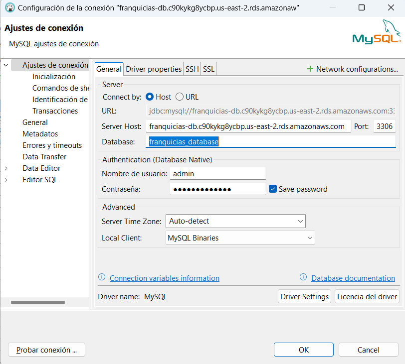

# Proyecto Franquicias

Este proyecto es una app para gestionar franquicias y sucursales. Se desarrolló utilizando programación reactiva con **Spring Webflux** para el backend y **R2DBC MySQL** como base de datos reactiva.

## Requisitos

- Java 17 o superior
- Maven
- Docker
- Docker Compose (Opcional)

## Configuración del Entorno

## Para correr desde Spring
1. Clona el repositorio:
   https://github.com/ItzJunixs/franquicias-prueba.git
2. Asegúrate de tener Maven instalado en tu sistema. Luego, ejecuta:
   **mvn clean install**
3. Ejecuta la aplicacion.

Nota: No te preocupes por el application.properties, ya está configurada la conexión para que se conecte a una RDS.
A continuación comparto las credenciales por si deseas realizar una conexión en tu gestor de base de datos:
- {HOST}: my_host
- {PUERTO}: 3306
- {NOMBRE_DATABASE}: franquicias_database
- {USUARIO}: admin
- {CONTRASEÑA}: mypassword

*Imagen de referencia (En este caso yo utiizo DBeaver)*

## Para correr desde docker
1. Abre Docker Desktop.
2. Desde la raiz del proyecto ejecuta el comando **docker build -t franquicias-app .**
Nota: Es importante el punto al final (.)

## Utiliza Postman o tu herramienta de preferencia para probar los endpoints (en el paquete resources encuentras la colección postman).

 
   
